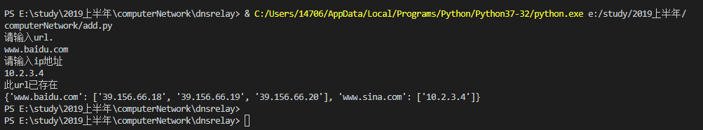
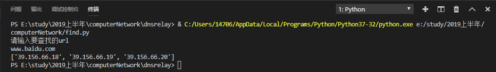
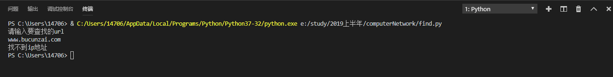

# 设计

## 需求

设计一个DNS服务器程序，读入“域名-IP地址” 对照表，当客户端查询域名对应的IP地址时， 用域名检索该对照表，实现下列三种情况：
- 检索结果为IP地址0.0.0.0，则向客户端返回“域名不存在”的报错消息（即不良网站拦截功能）
- 检索结果为普通IP地址，则向客户返回这个地址（即DNS服务器功能）
- 表中未检到该域名，则向实际的本地DNS服务器发出查询，并将结果返给客户端（即DNS中继功能）

## 功能设计

### 命令行参数与选项

在shell输入`python dnsrelay.py --help`可以查看以下帮助信息

```
usage: dnsrelay.py [-h] [-d | -dd] [dns-server-ipaddr] [filename]

positional arguments:
  dns-server-ipaddr  dns server ip address, "10.3.9.5" by default
  filename           dns file name, "dnsrelay.yml" by default

optional arguments:
  -h, --help         show this help message and exit
  -d                 level-1 debug
  -dd                level-2 debug
```

其中`level-1 debug`模式会输出调试信息，`level-2 debug`模式会输出详细调试信息，如果没有参数`-d | -dd`则不开启debug，仅显示UDP服务器是否开启。

### DNS中继功能

启动UDP服务器后开始监听53端口。如果收到包，首先检测本地cache文件，如果存在匹配项且不为`0.0.0.0`则回复，如果为`0.0.0.0`则回复域名不存在。如果本地cache文件找不到对应的域名，则向DNS服务器发送请求，并将DNS服务器的返回包回复给客户端。

### 网络通信与超时设计

NetController模块使用一个socket监听53端口。如果需要向DNS服务器发送请求则新建一个socket向DNS服务器发送请求，并在设置超时时间之后进行等待。如果超时则停止接收并输出超时提示，如果在超时时间内收到回复则返回客户端。

### 数据存储与多IP设计

data模块使用dict的key-value结构来在本地文件中存储url和对应的ip。关于多ip设计，value部分使用一个list来对同一个url的多个ip进行存储。查找时，输入url，返回对应的ip的list，或返回空list。添加记录时，将url和ip以key-value的格式插入到本地文件。

### 并发设计

考虑到同一时间存在多个客户端向服务器发送dns请求的情况，故需要进行并发设计。该部分由processor模块实现

为了同时处理多个客户端的请求，processor模块采用了多线程机制，对于每一个net模块发来的数据包，都会新开一个线程对其进行处理，从而达到并发与即时相应的处理效果，如以下代码所示：

```python
	def parse(self, data: dict):
		'''
		may be called many times simultaneously, need concurrency control
		'''
		# TODO: parse data and get result
		t1 = threading.Thread(target=self.doParse, args = (data,))
		t1.start()

		# self.doParse is a function to parse data
```

为了将从远程dns主机回复过来的数据发给正确的请求客户端，程序内建立了一张“id : {ip, port}”映射表，当本地没有合适的数据给客户端时，会将dns请求的id、ip地址和端口号存入映射表中，然后将请求转发给远程dns服务器；当收到远程dns服务器回复的数据时，根据包中的id获得映射表中的ip和端口号，发送给请求客户端，然后把相应id对应的字段从映射表中删除。
```python
# 初始化部分
	self.queryList = {}

# 数据处理部分
	if data['data']['header']['qr']:
		if self.queryList.get(data['data']['header']['id'], None) != None:
			self.parseNames(newData)
			data['address'] = self.queryList.pop(data['data']['header']['id'], {})
			self.net.reply(data)
```

对于并发机制而言，此功能做的并不完善，因为不用客户端发来的请求id可能是相同的。考虑到这种情况，解决的思路是：为每一个需要发送给远端的请求设置一个新的id，然后将此id作为关键字存储到“ 新id : {旧id, ip port}”映射表中，从而达到将请求发送给正确的客户端的目的。由于开发时间紧缺的缘故，该解决方案未能成功实施。

## 环境

- 操作系统 - Windows 10
- 编程语言 - Python3
- 依赖库
  - [refdict 3.2.0](https://pypi.org/project/refdict/)
  - [PyYAML 5.1.1](https://pypi.org/project/PyYAML/)

## 模块划分

### 模块划分图


### dnsrelay模块

负责命令行参数与选项的处理

### net模块

负责：
- 网络通信，包括直接回复客户端和向DNS服务器查询后回复客户端
- 数据包内数据与python内置数据类型dict的转换

### processor模块

负责对dict类型的数据包进行解析，根据协议作出一些行为。需要并发处理

### data模块

负责维护数据与文件，在给定域名时对IP地址进行查找

## 软件流程图

### 包数据格式

此处定义了把DNS报文解析为python的内置类型dict时dict的数据格式，用来作为Processor.parse/NetController.reply/NetController.query三个函数的参数使用

```python
data = {
	'address': {
		'ip': str,
		'port':int
	},
	'data': {
		'header': {
			'id': bytes,
			'qr': bool,
			'opcode': int,
			'aa': bool,
			'tc': bool,
			'rd': bool,
			'ra': bool,
			'rcode': int,
			'qdcount': int,
			'ancount': int,
			'nscount': int,
			'arcount': int
		},
		'question': [{
			'qname': bytes,
			'qtype': int,
			'qclass': int
		}],
		'answer': [{
			'name': bytes,
			'type': int,
			'class': int,
			'ttl': int,
			'rdlength': int,
			'rdata': bytes
		}],
		'authority': [{ # same as the format of data['answer']
			'name': bytes,
			'type': int,
			'class': int,
			'ttl': int,
			'rdlength': int,
			'rdata': bytes
		}],
		'additional': [{ # same as the format of data['answer']
			'name': bytes,
			'type': int,
			'class': int,
			'ttl': int,
			'rdlength': int,
			'rdata': bytes
		}]
	},
	'rawData': bytes
}
```

其中`name`或`qname`字段可能以`0b11`开头，表示引用包内其他名称。也可能为正常的字符串。如果是正常的字符串，则串尾包含`\0`

### 模块级并发设计

每次NetController接收到一个新的请求，都会调用Processor.parse。Processor.parse被调用后创建一个解析包的进程或线程后立即返回以防止NetController阻塞。因为parse可能调用Data.add引起Data内部数据的改变，所以需要对Data实例进行加锁保护。因为并行的Processor.parse可能同时多次调用NetController.reply或NetController.query，而NetController.query与NetController.reply会写发送缓冲区，所以Processor调用NetController.reply和NetController.query的时候也需要加锁。并发控制完全由Processor模块负责

### 正常检索地址


### 检索不良地址


### 未检索到地址


## 测试用例以及运行结果

### 单元测试

- 测试net模块

主要测试packageToDict函数和dictToPackage函数是否运行正确。使用测试代码如下：

```python
net = NetController('', '')
f = open('../test/packageToDict.bin', 'rb')
data = f.read()
f.close()
dictData = net.packageToDict(data, ('', 0))
print(dictData)
address, binData = net.dictToPackage(dictData)
print(binData)
print(data == binData)
```

先把测试文件packageToDict.bin中的二进制数据使用packageToDict转换为dict，然后再转换为二进制数据，检测输出是否和源文件相同。输出结果：

```python
refdict({'address': {'ip': '', 'port': 0}, 'data': {'header': {'id': b'\x00\x02', 'qr': True, 'opcode': 0, 'aa': False, 'tc': False, 'rd': True, 'ra': True, 'rcode': 0, 'qdcount': 1, 'ancount': 3, 'nscount': 0, 'arcount': 0}, 'question': [{'qname': b'\x03www\x05baidu\x03com\x00', 'qtype': 1, 'qclass': 1}], 'answer': [{'name': b'\xc0\x0c', 'type': 5, 'class': 1, 'ttl': 272, 'rdlength': 15, 'rdata': b'\x03www\x01a\x06shifen\xc0\x16'}, {'name': b'\xc0+', 'type': 1, 'class': 1, 'ttl': 107, 'rdlength': 4, 'rdata': b"'\x9cB\x0e"}, {'name': b'\xc0+', 'type': 1, 'class': 1, 'ttl': 107, 'rdlength': 4, 'rdata': b"'\x9cB\x12"}], 'authority': [], 'additional': []}, 'rawData': b"\x00\x02\x81\x80\x00\x01\x00\x03\x00\x00\x00\x00\x03www\x05baidu\x03com\x00\x00\x01\x00\x01\xc0\x0c\x00\x05\x00\x01\x00\x00\x01\x10\x00\x0f\x03www\x01a\x06shifen\xc0\x16\xc0+\x00\x01\x00\x01\x00\x00\x00k\x00\x04'\x9cB\x0e\xc0+\x00\x01\x00\x01\x00\x00\x00k\x00\x04'\x9cB\x12"})
b"\x00\x02\x81\x80\x00\x01\x00\x03\x00\x00\x00\x00\x03www\x05baidu\x03com\x00\x00\x01\x00\x01\xc0\x0c\x00\x05\x00\x01\x00\x00\x01\x10\x00\x0f\x03www\x01a\x06shifen\xc0\x16\xc0+\x00\x01\x00\x01\x00\x00\x00k\x00\x04'\x9cB\x0e\xc0+\x00\x01\x00\x01\x00\x00\x00k\x00\x04'\x9cB\x12"
True
```

结果正确

- 测试processor模块

主要测试字节形式的域名转换为字符串形式的域名函数bytesNameToStr、字节形式的ip地址与字符串形式的ip地址相互转换的函数bytesIpToStr、映射表内容的修改。测试代码如下：

```python
# bytesNameToStr函数
bytesAddress = b'\x03www\x05baidu\x03com'
print(bytesNameToStr(bytesAddress))

# bytesIpToStr函数
bytesIp = b'\x0a\x03\x67\xfc'
print(bytesIpToStr(bytesIp))

# 字符串ip地址转为字节形式ip地址
ipStr = '145.165.205.255'
print(bytes(bytearray(list(map(int, ipStr.split('.'))))))

# 映射表内容
p = Processor()
data = refdict({'address': {'ip': '1.1.1.1', 'port': 5555}, 
				'data': {
					'header': {
						'id': b'\x00\x02', 
						'qr': False, 'opcode': 0, 
						'aa': False, 'tc': False, 
						'rd': True, 'ra': True, 
						'rcode': 0, 
						'qdcount': 1, 'ancount': 0, 
						'nscount': 0, 'arcount': 0
					}, 
					'question': [{'qname': b'\x03www\x05baidu\x03com\x00', 'qtype': 1, 'qclass': 1}], 
					'answer': [], 'authority': [], 'additional': []}, 
					'rawData': b"\x00\x02\x81\x80\x00\x01\x00\x03\x00\x00\x00\x00\x03www\x05baidu\x03com\x00\x00\x01\x00\x01\xc0\x0c\x00\x05\x00\x01\x00\x00\x01\x10\x00\x0f\x03www\x01a\x06shifen\xc0\x16\xc0+\x00\x01\x00\x01\x00\x00\x00k\x00\x04'\x9cB\x0e\xc0+\x00\x01\x00\x01\x00\x00\x00k\x00\x04'\x9cB\x12"})
p.parse(data)
print(p.queryList)
```

测试结果：

```python
www.baidu.com										# bytesNameToStr函数
10.3.103.252										# bytesIpToStr函数
b'\x91\xa5\xcd\xff'									# 字符串ip地址转为字节形式ip地址
{b'\x00\x02': {'ip': '1.1.1.1', 'port': 5555}}		# 映射表内容
```

可见，测试结果均正确

- 测试data.add

源代码：

```python
# add  a record to self.data
import yaml
#d = {'www.baidu.com':'39.156.66.18'} 
# save current data to data file
#f = open('add_find.yaml', 'w', encoding='utf-8')
#yaml.safe_dump(d, f)
#f.close()

url = input()
ip = input()

#test whetherthe record is successfully added
f = open('add_find.yaml', encoding='utf-8')
data = yaml.safe_load(f)
f.close()

#write
data[url] = ip
f = open('add_find.yaml', 'w', encoding='utf-8')
yaml.safe_dump(data, f)
f.close()

#test the result
f = open('add_find.yaml', encoding='utf-8')
data = yaml.safe_load(f)
print(data)# add  a record to self.data
import yaml
#d = {'www.baidu.com':['39.156.66.18']} 
# save current data to data file
#f = open('add_find.yaml', 'w', encoding='utf-8')
#yaml.safe_dump(d, f)
#f.close()


print("请输入url.")
url = input()
print("请输入ip地址")
ip = input()

#load data
f = open('add_find.yaml', encoding='utf-8')
data = yaml.safe_load(f)
f.close()

# change data
if url in data:
    print("url已存在")
else    :
    data[url] = [ip]

#write
f = open('add_find.yaml', 'w', encoding='utf-8')
yaml.safe_dump(data, f)
f.close()

#test the result
f = open('add_find.yaml', encoding='utf-8')
data = yaml.safe_load(f)
print(data)
```

测试结果及截图：

(1)插入一个已存在的url：



(2)插入一个新的url和对应ip:


- 测试data.add_init

源代码：

```python
#add_init
import yaml
d = {'www.baidu.com':['39.156.66.18','39.156.66.19']} 
# save current data to data file
f = open('add_find.yaml', 'w', encoding='utf-8')
yaml.safe_dump(d, f)
f.close()

#test the result
f = open('add_find.yaml', encoding='utf-8')
data = yaml.safe_load(f)
print(data)
```

截图：

初始化数据文件内容：


- 测试data.find

源代码：

```python
'''
- if `url` is found, return its ip address
- if `url` is '0.0.0.0', return '0.0.0.0'
- if `url` is not found, return empty str
'''
import yaml
f = open('add_find.yaml', encoding='utf-8')
data = yaml.safe_load(f)
f.close()

print('请输入要查找的url')
url = input()

if url in data :
	print(data[url])
else:
	print('找不到ip地址')
```

截图：

(1)查找成功：



(2)查找失败：



### 集成测试

根据任务需求，按照以下方案执行集成测试（初始状态下dns服务器的IP缓存为空）

测试环境配置：设置本机默认dns服务器IP为127.0.0.1，关闭防火墙


(1)基本情况测试

使用nslookup请求一个域名的IP，观察结果：


观察存储IP的文件内容：


断网，使用nslookup再次请求该域名的IP，观察结果：


可见，服务器可以处理基本的dns请求

(2)多IP测试

使用nslookup请求v.qq.com的IP，观察结果：


观察存储IP的文件内容：


断网，使用nslookup再次请求该域名的IP，观察结果：


可见，服务器可以处理多ip域名的dns请求

(3)IP屏蔽测试

在存储IP的文件中，将 www.baidu.com 的IP设置为0.0.0.0


使用nslookup请求 www.baidu.com 的IP，观察结果：


可见，服务器可以实现对域名访问的屏蔽功能

(4)并发测试

同时打开多个网站，并进行抓包，观察抓到的请求包和回复包的顺序


可见，服务器可以实现并发处理多个请求

(5)超时处理测试

断网，并向服务器发送存储表中没有的域名请求，观察服务器输出：


可见，服务器可以显示请求超时信息
